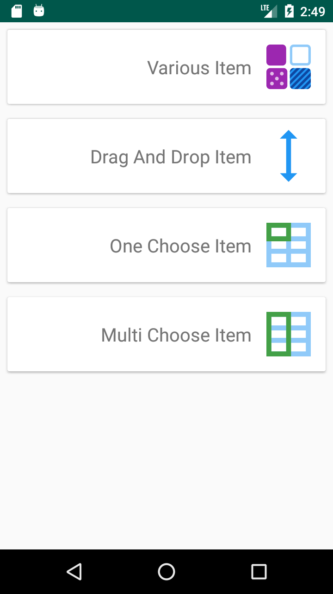

# EasyRecycler [](https://jitpack.io/#ahmadaghazadeh/easyRecycler)

This is a data binding easy use recycler

Please note that this library is currently supported on android API 7 and above.

EasyRecycler have  None,OneChoose, DragDrop, MultiChoose mode.


[](https://youtu.be/HREz61ww4hc)

<div align="center">
  <a href="https://youtu.be/HREz61ww4hc"></a>
</div>

Integration with existing project
---

### Setup

##### build.gradle (project)
```groovy
allprojects {
    repositories {
       
        maven {
            url 'https://jitpack.io'
        }
    }
}
```

#### build.gradle (app)
```groovy
dependencies {
     
    implementation 'com.github.ahmadaghazadeh:EasyRecycler:1.0.2'
}
```
 
 
Demo Activity:

```java

public class TextItem extends BaseRecyclerModel {
    public TextItem(String text) {
        this.text = text;
    }

    public String text;
    @Override
    public int getLayoutId() {
        return R.layout.item_text;
    }
}

```

```java

public class TextItem extends BaseRecyclerModel {
    public TextItem(String text) {
        this.text = text;
    }

    public String text;
    @Override
    public int getLayoutId() {
        return R.layout.item_text;
    }

}

```

```java

public class MainActivity extends AppCompatActivity {

    @Override
    protected void onCreate(Bundle savedInstanceState) {
        super.onCreate(savedInstanceState);
        ActivityMainBinding mViewDataBinding = DataBindingUtil.setContentView(this, R.layout.activity_main);
        EasyAdapter<BaseRecyclerModel> adapter=new EasyAdapter<>();
        List<BaseRecyclerModel> lst=new LinkedList<>();
        lst.add(new ImageItem(1));
        lst.add(new TextItem("Ahmad"));
        lst.add(new ImageItem(2));
        lst.add(new TextItem("Aghazadeh"));
        adapter.init(lst);
        adapter.setEmptyItemViewModelListener(new EmptyViewModel.EmptyItemViewModelListener() {
            @Override
            public void onRetryClick() {
                Toast.makeText(MainActivity.this,"onRetryClick",Toast.LENGTH_LONG).show();
            }
        });
        mViewDataBinding.recycler.setAdapter(adapter);
    }
}

```
